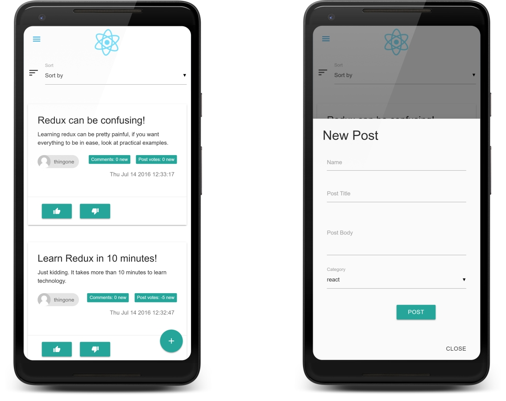

# Readable

This app is created with react and is influenced by Udacity's second project of React Nanodegree.

>This project is a part of [Udacity's](https://github.com/udacity) React Nano Degree (All rights belong to Udacity). This is a small social website. You can post your article and people can read, upvote and comment on your post. It takes full use of redux for storing state of the app. This beautiful app was created with [materializecss](https://materializecss.com).

## Dependencies

* react
* redux
* react-router-dom
* react-redux
* Any other can be found in the [package.json](package.json)

## Credit

Created by [Saurabh Thakur](http://github.com/thakursaurabh1998).